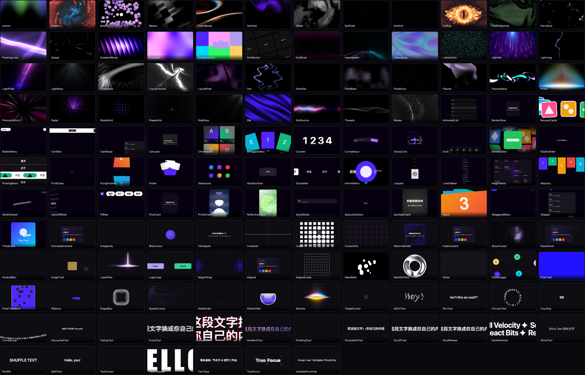

<div align="center">

# Motion Picker

**给 AI 编程助手配一个「动效选型台」**

139 个 React 动效组件的本地库 · 可视化挑选调参 · 挑完交给 AI 自动适配集成

[](https://github.com/biily786063474-boop/motion-picker/actions/workflows/smoke.yml)
[](LICENSE)
[](package.json)
[](#为什么不是直接让-ai-写)
[](#组件总览)


</div>

---

## 这解决什么问题

你跟 AI 说「给这个落地页加个动效」，然后：

- AI 写了一段它想象中的 CSS 动画，效果平庸，来回改五轮
- 或者它推荐一个组件库，但**没法让你先看看长什么样**
- 你自己去翻组件站，看中一个，复制代码进项目，**白屏** —— 少装了依赖、少拷了资源、默认值里有个外链图挂了

问题的根子是：**挑效果需要眼睛，集成代码需要上下文，这两件事该分开。**

Motion Picker 就是把它们分开：

| 谁 | 干什么 |
|---|---|
| **你** | 在本地选型台里看实时预览、拖参数，调到满意 |
| **AI** | 拿着「组件源码 + 你调的参数 + 依赖清单 + 兼容性诊断」，按你项目的技术栈适配集成 |



---

## 卖点

### 🎯 挑效果这件事交还给人

AI 判断不了「哪个好看」「参数调到什么程度合适」。选型台给你实时预览 + 自动生成的参数面板，拖到满意为止。

<table>
<tr>
<td width="50%"><br><sub><b>LiquidEther</b> · 流体跟随鼠标</sub></td>
<td width="50%"><br><sub><b>Silk</b> · 丝绸质感着色器</sub></td>
</tr>
<tr>
<td><br><sub><b>MagicBento</b> · 聚光卡片网格</sub></td>
<td><br><sub><b>Prism</b> · 棱镜色散</sub></td>
</tr>
<tr>
<td><br><sub><b>SplitText</b> · 逐字入场</sub></td>
<td><br><sub><b>ClickSpark</b> · 点击火花</sub></td>
</tr>
</table>

### 🔧 参数面板是自动生成的，不是手写的

139 个组件共用**一套推断逻辑**，没有一行代码是为某个具体组件写的。1608 个 prop 里 **94.3% 能自动生成控件**——滑块的取值范围从 prop 名的量纲、文档里的 `(0-1)`、默认值的量级三层推出来；下拉的选项从文档描述里挖出来（`Split type: "chars", "words", "lines"`）。

### 🩺 拷进项目前先体检

这是最值钱的部分。组件源码按 React 19 + Tailwind 4 写的，你的项目往往不是：

```
✗ SpotlightCard 用了 Tailwind 工具类，但宿主没装 tailwindcss
   —— 组件会挂载成功但完全没有样式，控制台不会报任何错
   → 给宿主接上 Tailwind
   → 或手工把 className 改写成自己的样式方案

✗ Silk 依赖 @react-three/fiber，这套包硬性要求 React 19；宿主是 React 18
   npm 会直接拒绝安装。强行装进去 <Canvas> 会把整个 React 树带塌
   → 装 @react-three/fiber@^8 与配套的 drei@^9
   → 或换一个零依赖组件（库里有 32 个）
```

这些都是实测踩出来的，不是猜的。

### 📦 依赖清单从源码 AST 推导

组件文档里写的依赖**实测 139 个里有 11 个是错的**——`Silk` 连依赖那行都没有（实际要 `@react-three/fiber` + `three`）、`PillNav` 漏了 `react-router-dom`、`GradualBlur` 反而多报了 `mathjs`。这个库不信文档，直接扫源码的 import。

### 🔌 离线可用

139 个组件源码 + 静态资源全在本地。取用组件**不需要联网、不需要 `npm install`**——依赖信息已经预计算好了。

---

## 快速开始

```bash
git clone https://github.com/biily786063474-boop/motion-picker.git ~/motion-picker
cd ~/motion-picker && node install.mjs
```

装完就能用了，**不需要 npm install**：

```bash
node ~/motion-picker/scripts/add.mjs --list                      # 看有哪些
node ~/motion-picker/scripts/add.mjs Orb --to ./src/components   # 拷进项目
```

想要可视化选型台（本地预览 139 个组件的实时效果）再装依赖：

```bash
cd ~/motion-picker && npm install    # 约 500MB，只影响预览，不影响取用
npm run dev                          # http://localhost:5180
```

环境有问题就跑体检，它按「取用 / 选型台 / skill 接线」三层告诉你哪里没就绪：

```bash
node ~/motion-picker/scripts/doctor.mjs
```

---

## 终端命令

```bash
# 列出组件
node scripts/add.mjs --list                 # 全部 139 个，按类目分组
node scripts/add.mjs --list three           # 按关键字/依赖筛
node scripts/add.mjs --list --no-deps       # 只看零依赖的（32 个）
node scripts/add.mjs --list --json          # 结构化输出，给程序解析

# 取用组件
node scripts/add.mjs Orb --to ./src/effects --dry-run       # 先看会发生什么
node scripts/add.mjs Orb --to ./src/effects                 # 真拷
node scripts/add.mjs Orb --to ./src/effects --force         # 覆盖已存在的
node scripts/add.mjs Lanyard --to ./src/effects \
     --public-dir ./public --asset-prefix /assets           # Electron 用，重写资源路径
node scripts/add.mjs Orb --to ./src/effects --json          # 结构化结果

# 选型台
npm run dev                  # 启动，默认 5180
PORT=5199 npm run dev        # 换端口

# 维护
node scripts/doctor.mjs      # 环境体检
npm run sync                 # 同步上游 react-bits（幂等，失败不落盘）
```

`add.mjs` 做的事比 `cp` 多：带走同目录资源、把 public 资源拷进宿主并重写路径、文件头盖出处戳（含原始 sha256 便于日后对账）、打印真实依赖、跑宿主体检、往项目写 `.rb-manifest.json` 记录取过什么。写入是原子的——先算完整计划并校验前置条件，全通过才写，中途失败回滚。

---

## 接入你的 AI 助手

核心是两件事：**让 AI 知道这个库存在**，以及**让它知道什么时候用、怎么用**。

### Claude Code

`node install.mjs` 已经装好了 skill，直接说「加个动效」就会触发。

手工装：

```bash
ln -s ~/motion-picker/skill ~/.claude/skills/motion-picker
echo ~/motion-picker > ~/.claude/skills/motion-picker/lib-path
```

### Cursor

在项目里建 `.cursor/rules/motion-picker.mdc`：

```markdown
---
description: 需要视觉动效、背景特效、文字动画时使用
globs:
alwaysApply: false
---

用户要动效/背景效果/文字动画时，用本地组件库而不是自己写 CSS：

1. `node ~/motion-picker/scripts/add.mjs --list` 看有哪些（139 个）
2. 想让用户挑：`cd ~/motion-picker && npm run dev`，让他在 http://localhost:5180 选完点「交给 AI」，
   然后读 `~/motion-picker/.rb-selection.json` 拿他的选择和调好的参数
3. 取用：`node ~/motion-picker/scripts/add.mjs <组件名> --to <目标目录>`
4. **必须处理它打印的体检警告** —— 没 Tailwind 会静默无样式，React 18 装不了 three 系组件
5. 完整说明见 ~/motion-picker/skill/SKILL.md
```

### Windsurf

`.windsurfrules`：

```
需要动效/背景特效/文字动画时，用本地组件库：
  查看：node ~/motion-picker/scripts/add.mjs --list
  取用：node ~/motion-picker/scripts/add.mjs <组件名> --to <目标目录>
  选型台：cd ~/motion-picker && npm run dev
必须处理 add.mjs 打印的宿主体检警告。详见 ~/motion-picker/skill/SKILL.md
```

### Cline / Roo Code

`.clinerules`：

```
## 动效组件库
用户要视觉动效时不要自己写 CSS 动画，用 ~/motion-picker：
- node ~/motion-picker/scripts/add.mjs --list          列出 139 个组件
- node ~/motion-picker/scripts/add.mjs X --to <dir>    拷进项目
体检警告必须逐条处理（Tailwind 缺失会静默无样式；React 18 装不了 @react-three/*）。
完整流程见 ~/motion-picker/skill/SKILL.md
```

### GitHub Copilot

`.github/copilot-instructions.md`：

```markdown
## 视觉动效

需要背景特效、文字动画、交互效果时，用本地库 `~/motion-picker`
（139 个 React 组件），不要手写 CSS 动画：

- 列出：`node ~/motion-picker/scripts/add.mjs --list`
- 取用：`node ~/motion-picker/scripts/add.mjs <组件名> --to <目标目录>`

取用后必须处理命令打印的宿主兼容性警告。
```

### Codex CLI / 任何认 AGENTS.md 的工具

项目根目录 `AGENTS.md`：

```markdown
## 动效组件

需要视觉动效时用 `~/motion-picker`（139 个 React 组件，离线可用）：

    node ~/motion-picker/scripts/add.mjs --list
    node ~/motion-picker/scripts/add.mjs <组件名> --to <目标目录>

组件按 React 19 + Tailwind 4 写的，取用命令会打印宿主兼容性诊断，逐条处理。
完整流程：~/motion-picker/skill/SKILL.md
```

### Gemini CLI

`GEMINI.md`，内容同上。

### 通用：任何能跑 shell 的 agent

不认规则文件也没关系，这套东西本质就是几条命令：

```bash
node ~/motion-picker/scripts/add.mjs --list --json     # 拿到全部组件的结构化清单
node ~/motion-picker/scripts/add.mjs <名字> --to <目录> --json   # 取用，拿结构化结果
```

`--json` 模式下 stdout 只有 JSON（人类可读信息走 stderr），管道安全。

### 程序化调用（Electron 主进程 / 自建工具 / MCP server）

核心逻辑是纯函数，不碰终端：

```js
import { addComponent, listComponents, inspectHost } from '~/motion-picker/scripts/lib/add-core.mjs';

const list = listComponents({ noDeps: true });          // 32 个零依赖组件
const check = inspectHost(comp, '/path/to/your/project'); // 兼容性诊断
const r = await addComponent({ name: 'Orb', to: '/abs/path', dryRun: true });
// → { ok, written[], deps: {missing, satisfied}, warnings[], manifest }
```

---

## 应用场景

**落地页 / 官网 Hero 区**
`Aurora` `Silk` `LiquidEther` `Threads` `Iridescence` —— 全屏着色器背景，一行组件顶一套设计稿

**产品介绍页**
`MagicBento` 聚光卡片网格、`ScrollStack` 滚动堆叠、`CircularGallery` 环形画廊

**登录 / 启动页**
`Orb` `Galaxy` `Particles` `Lightning` —— 有存在感但不喧宾夺主

**标题与文案**
`SplitText` 逐字入场、`DecryptedText` 解密效果、`ShinyText` 流光、`CountUp` 数字滚动、`RotatingText` 轮播

**交互反馈**
`ClickSpark` 点击火花、`Magnet` 磁吸、`GlareHover` 扫光、`SpotlightCard` 聚光卡片、`ElectricBorder` 电光边框

**Electron / 桌面应用**
全部离线可用；取用时加 `--asset-prefix` 重写资源路径（`file://` 协议下根绝对路径会挂）

**空状态 / 加载中**
`Ballpit` `MetaBalls` `Ribbons` —— 比转圈 loading 有意思

---

## 为什么不是直接让 AI 写

| | AI 手写 CSS/Canvas | 这个库 |
|---|---|---|
| 看效果 | 写完才知道，来回改 | **先看再要** |
| 质量 | 取决于 prompt 和运气 | 139 个成熟组件，上游持续维护 |
| 调参 | 说「快一点」「再淡一点」 | 拖滑块实时看 |
| 依赖 | 常常漏装 | AST 推导，实测比文档准 |
| 资源 | 忘拷 → 白屏 | 自动跟着走 |
| 离线 | 默认值常带外链 | 全本地，外链会被标出来 |
| token | 每次都要重新描述效果 | 组件已存在，只需说名字 |

---

## 项目结构

```
components/     139 个 .tsx 源码，与上游字节一致
prompts/        139 份集成说明（依赖/用法/props 表/集成步骤）
  index.json    检索索引 + 取用元数据（真实依赖、资源、外链、导出形式）
  props.json    结构化 prop 元数据，选型台的参数面板靠它生成
public/         组件要用的公共资源 + draco 解码器
playground/     可视化选型台
skill/          Claude Code skill
scripts/
  add.mjs       取用 CLI
  lib/add-core.mjs   纯逻辑核心，可被任何程序 import
  doctor.mjs    环境体检
  build-prompts.mjs  从上游重新生成全部产物（原子写）
```

---

## 致谢与许可

组件来自 **[DavidHDev/react-bits](https://github.com/DavidHDev/react-bits)**（MIT），
这个项目是它的本地化工具：把组件源码、集成说明、可视化选型台和取用管线打包在一起，让 AI 编程助手能用上。

**组件代码的版权归 react-bits 作者所有。** `components/` 目录与上游保持字节一致，
取用时会在文件头盖上出处戳（上游仓库、commit、许可证、原始 sha256）。

本项目自身的代码（选型台、CLI、管线、skill）同样以 MIT 发布，见 [LICENSE](LICENSE)。

如果这些组件帮到了你，去给 [react-bits](https://github.com/DavidHDev/react-bits) 点个 star。
